### Maven

#### maven是什么

​	 **maven是一款服务于java平台的自动化构建工具** 

​	 构建定义：把动态的Web工程经过编译得到的编译结果部署到服务器上的整个过程 。

​	 编译：java源文件[.java]->编译->Classz字节码文件[.class] 

​	 部署：最终在sevlet容器中部署的不是动态web工程，而是编译后的文件 

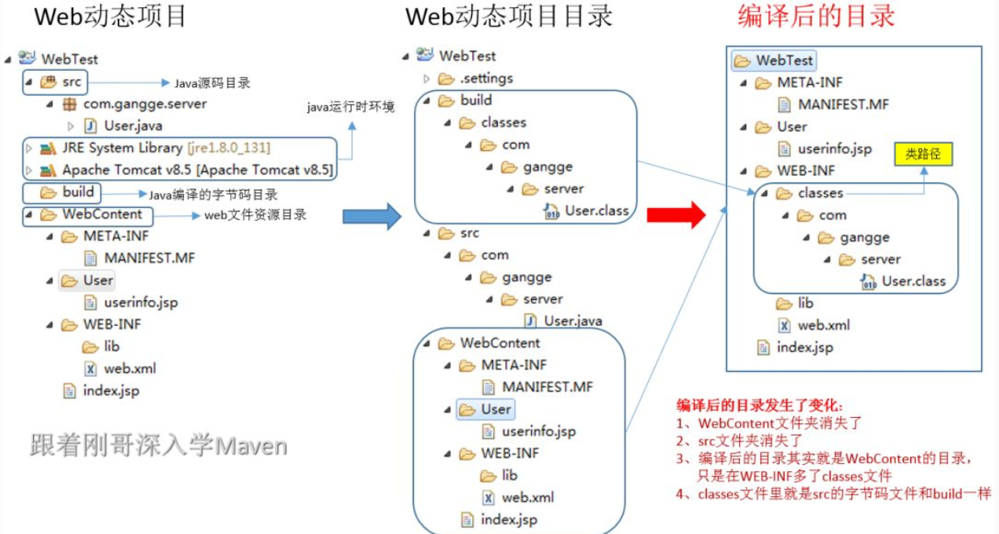

##### 构建的各个环节

- 清理clean：将以前编译得到的旧文件class字节码文件删除
- 编译compile：将java源程序编译成class字节码文件
- 测试test：自动测试，自动调用junit程序
- 报告report：测试程序执行的结果
- 打包package：动态Web工程打War包，java工程打jar包
- 安装install：Maven特定的概念-----将打包得到的文件复制到“仓库”中的指定位置
- 部署deploy：将动态Web工程生成的war包复制到Servlet容器下，使其可以运行

#### maven工程

工程目录：

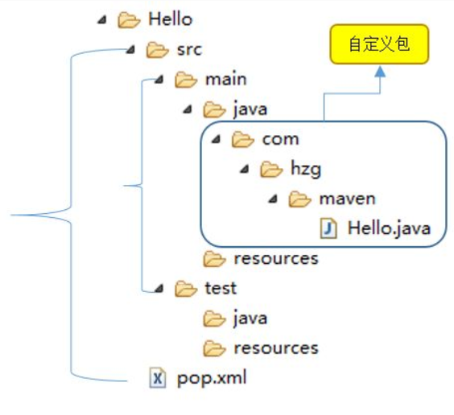

#### 常用maven命令

- mvn clean：清理
- mvn compile：编译主程序
- mvn test-compile：编译测试程序
- mvn test：执行测试
- mvn package：打包
- mvn install：安装


#### 坐标和仓库

**pom.xml：**Project Object Model 项目对象模型。它是maven的核心配置文件，所有的构建的配置都在这里设置。


 **坐标：**使用下面的三个向量在仓库中唯一的定位一个maven工程 

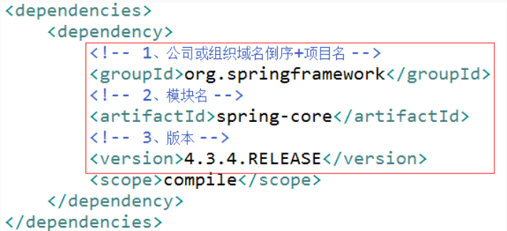

 

**maven工程的坐标与仓库中路径的关系：** 

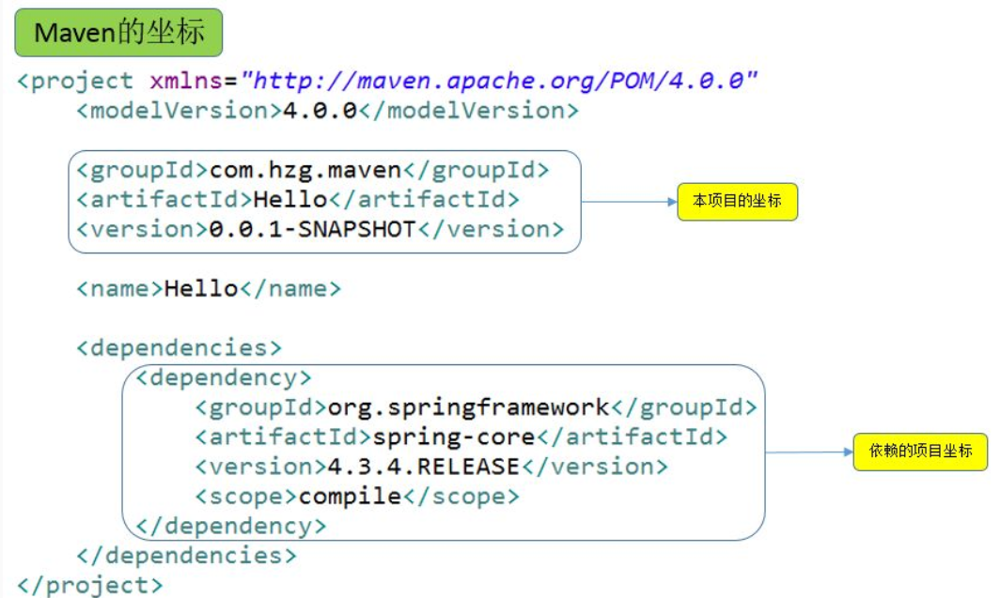

maven坐标和仓库对应的映射关系：

```
[groupId][artifactId][version][artifactId]-[version].jar
```

去本地仓库看一下此目录：org\springframework\spring-core\4.3.4.RELEASE\spring-core-4.3.4.RELEASE.jar

果然是完全对应的


**仓库**

仓库的分类：

**1、本地仓库：**当前电脑上的仓库

**2、远程仓库：**

- 私服：搭建在局域网中，一般公司都会有私服，私服一般使用nexus来搭建。
- 中央仓库：架设在Internet上，像刚才的springframework就是在中央仓库上


#### 依赖

**① maven解析依赖信息时会到本地仓库中取查找被依赖的jar包**

- 对于本地仓库中没有的会去中央仓库去查找maven坐标来获取jar包，获取到jar之后会下载到本地仓库
- 对于中央仓库也找不到依赖的jar包的时候，就会编译失败了

**② 如果依赖的是自己或者团队开发的maven工程，需要先使用install命令把被依赖的maven工程的jar包导入到本地仓库中**

举例：现在我再创建第二个maven工程HelloFriend，其中用到了第一个Hello工程里类的sayHello(String name)方法。我们在给HelloFriend项目使用 mvn compile命令进行编译的时候，会提示缺少依赖Hello的jar包。怎么办呢？

到第一个maven工程中执行 mvn install后，你再去看一下本地仓库，你会发现有了Hello项目的jar包。一旦本地仓库有了依赖的maven工程的jar包后，你再到HelloFriend项目中使用 mvn compile命令的时候，可以成功编译

 **③ 依赖范围** 

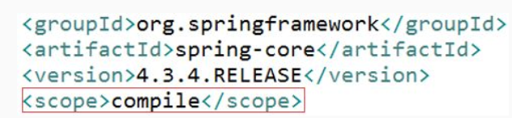

*scope就是依赖的范围*

**1、compile，**默认值，适用于所有阶段（开发、测试、部署、运行），本jar会一直存在所有阶段。

**2、provided，**只在开发、测试阶段使用，目的是不让Servlet容器和你本地仓库的jar包冲突 。如servlet.jar。

**3、runtime，**只在运行时使用，如JDBC驱动，适用运行和测试阶段。

**4、test，**只在测试时使用，用于编译和运行测试代码。不会随项目发布。

**5、system，**类似provided，需要显式提供包含依赖的jar，Maven不会在Repository中查找它。


#### 生命周期

Maven有三套相互独立的生命周期，请注意这里说的是“三套”，而且“相互独立”，初学者容易将Maven的生命周期看成一个整体，其实不然。这三套生命周期分别是：

**① Clean Lifecycle 在进行真正的构建之前进行一些清理工作。**Clean生命周期一共包含了三个阶段：

- pre-clean 执行一些需要在clean之前完成的工作
- clean 移除所有上一次构建生成的文件
- post-clean 执行一些需要在clean之后立刻完成的工作

**② Default Lifecycle 构建的核心部分，编译，测试，打包，部署等等。**

- validate
- generate-sources
- process-sources
- generate-resources
- process-resources 复制并处理资源文件，至目标目录，准备打包
- compile 编译项目的源代码
- process-classes
- generate-test-sources
- process-test-sources
- generate-test-resources
- process-test-resources 复制并处理资源文件，至目标测试目录
- test-compile 编译测试源代码
- process-test-classes
- test 使用合适的单元测试框架运行测试。这些测试代码不会被打包或部署
- prepare-package
- package 接受编译好的代码，打包成可发布的格式，如 JAR
- pre-integration-test
- integration-test
- post-integration-test
- verify
- install 将包安装至本地仓库，以让其它项目依赖。
- deploy 将最终的包复制到远程的仓库，以让其它开发人员与项目共享

那我们在Hello的项目中执行 mvn install 命令，通过日志看看中间经历了什么？

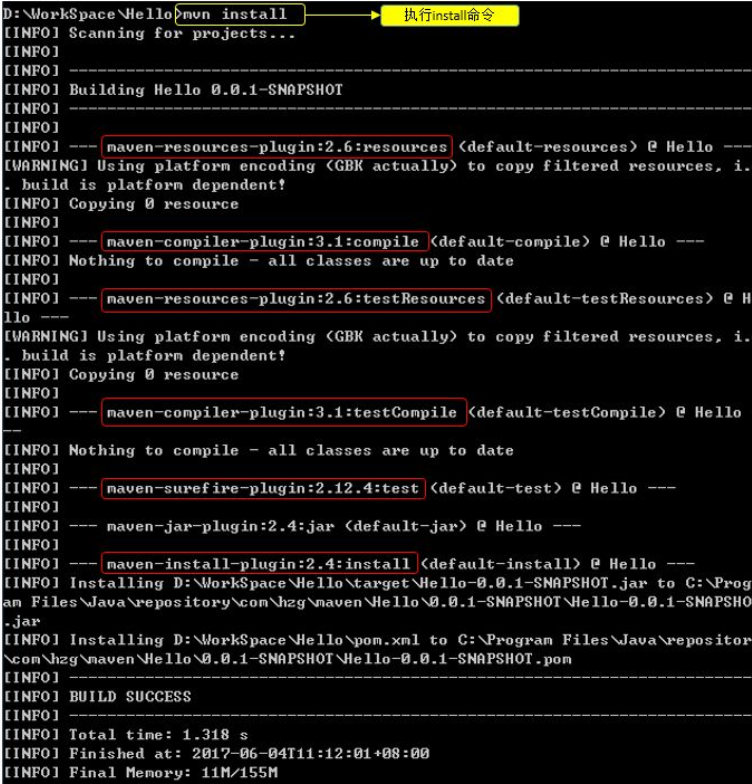

通过日志我们发现，其实执行mvn install，其中已经执行了compile 和 test 。

**总结：**不论你要执行生命周期的哪一个阶段，maven都是从这个生命周期的开始执行

**插件：**每个阶段都有插件（plugin），看上面标红的。插件的职责就是执行它对应的命令。

**③ Site Lifecycle 生成项目报告，站点，发布站点。**

- pre-site 执行一些需要在生成站点文档之前完成的工作
- site 生成项目的站点文档
- post-site 执行一些需要在生成站点文档之后完成的工作，并且为部署做准备
- site-deploy 将生成的站点文档部署到特定的服务器上


#### maven工程的依赖高级特性

 **① 依赖的传递性** 

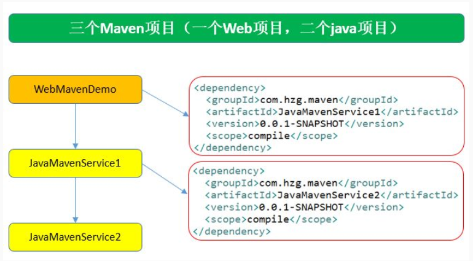

WebMavenDemo项目依赖JavaMavenService1 JavaMavenService1项目依赖JavaMavenService2

pom.xml文件配置好依赖关系后，必须首先mvn install后，依赖的jar包才能使用。

- WebMavenDemo的pom.xml文件想能编译通过，JavaMavenService1必须mvn install
- JavaMavenService的pom.xml文件想能编译通过，JavaMavenService2必须mvn install

**传递性：**

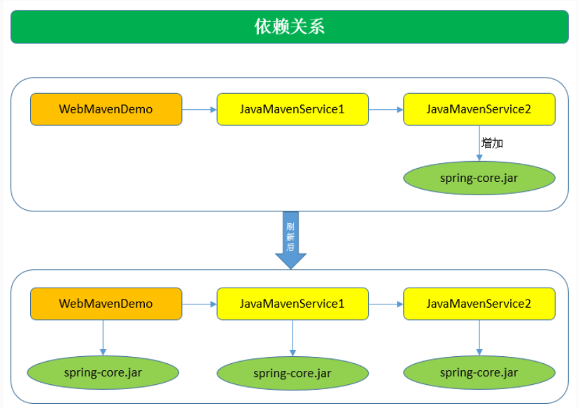

 注意：非compile范围的依赖是不能传递的。 

**② 依赖版本的原则：**

**1、路径最短者优先原则**

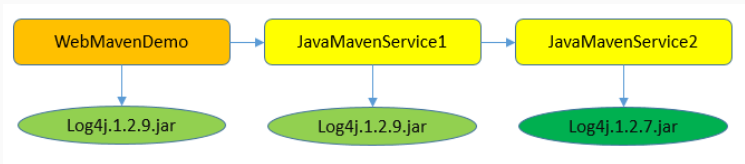

Service2的log4j的版本是1.2.7版本，Service1排除了此包的依赖，自己加了一个Log4j的1.2.9的版本，那么WebMavenDemo项目遵守路径最短优先原则，Log4j的版本和Sercive1的版本一致。

**2、路径相同先声明优先原则**

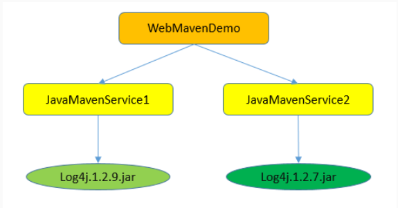

这种场景依赖关系发生了变化，WebMavenDemo项目依赖Sercive1和Service2，它俩是同一个路径，那么谁在WebMavenDemo的pom.xml中先声明的依赖就用谁的版本。

**③ 统一管理依赖的版本：**

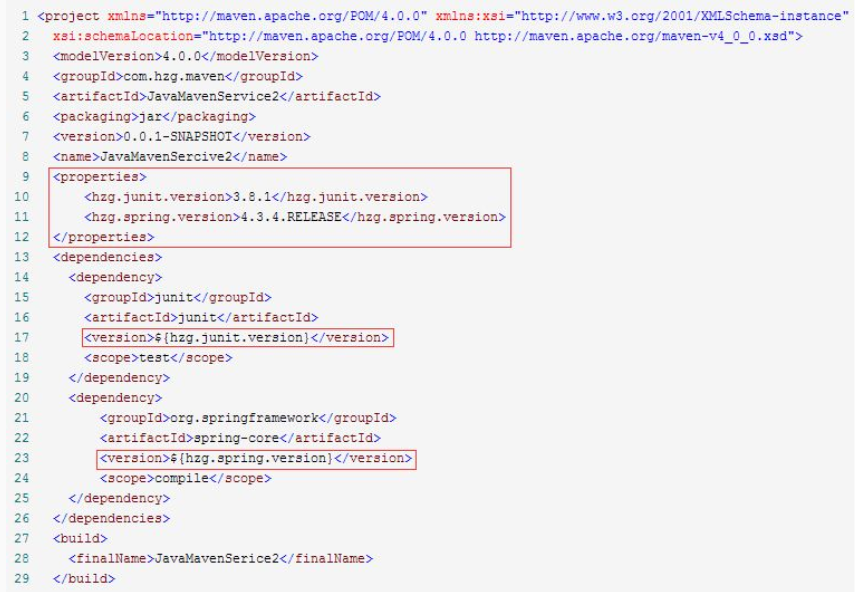

为了统一管理版本号，可以使用properties标签，里面可以自定义版本的标签名。在使用的地方使用${自定义标签名}                        


#### build配置

```pom
<build>
　　<!-- 项目的名字 -->
　　<finalName>WebMavenDemo</finalName>
　　<!-- 描述项目中资源的位置 -->
　　<resources>
　　　　<!-- 自定义资源1 -->
　　　　<resource>
　　　　　　<!-- 资源目录 -->
　　　　　　<directory>src/main/java</directory>
　　　　　　<!-- 包括哪些文件参与打包 -->
　　　　　　<includes>
　　　　　　　　<include>**/*.xml</include>
　　　　　　</includes>
　　　　　　<!-- 排除哪些文件不参与打包 -->
　　　　　　<excludes>
　　　　　　　　<exclude>**/*.txt</exclude>
　　　　　　　　　　<exclude>**/*.doc</exclude>
　　　　　　</excludes>
　　　　</resource>
　　</resources>
　　<!-- 设置构建时候的插件 -->
　　<plugins>
　　　　<plugin>
　　　　　　<groupId>org.apache.maven.plugins</groupId>
　　　　　　<artifactId>maven-compiler-plugin</artifactId>
　　　　　　<version>2.1</version>
　　　　　　<configuration>
　　　　　　　　<!-- 源代码编译版本 -->
　　　　　　　　<source>1.8</source>
　　　　　　　　<!-- 目标平台编译版本 -->
　　　　　　　　<target>1.8</target>
　　　　　　</configuration>
　　　　</plugin>
　　　　<!-- 资源插件（资源的插件） -->
　　　　<plugin>
　　　　　　<groupId>org.apache.maven.plugins</groupId>
　　　　　　<artifactId>maven-resources-plugin</artifactId>
　　　　　　<version>2.1</version>
　　　　　　<executions>
　　　　　　　　<execution>
　　　　　　　　　　<phase>compile</phase>
　　　　　　　　</execution>
　　　　　　</executions>
　　　　　　<configuration>
　　　　　　　　<encoding>UTF-8</encoding>
　　　　　　</configuration>
　　　　</plugin>
　　　　<!-- war插件(将项目打成war包) -->
　　　　<plugin>
　　　　　　<groupId>org.apache.maven.plugins</groupId>
　　　　　　<artifactId>maven-war-plugin</artifactId>
　　　　　　<version>2.1</version>
　　　　　　<configuration>
　　　　　　　　<!-- war包名字 -->
　　　　　　　　<warName>WebMavenDemo1</warName>
　　　　　　</configuration>
　　　　</plugin>
　　</plugins>
</build>
```

 配置好build后，执行mvn package之后，在maven工程指定的target目录里war包和文件都按照配置的生成了 

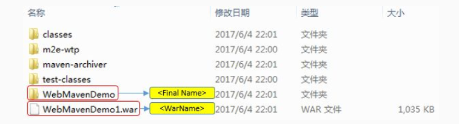