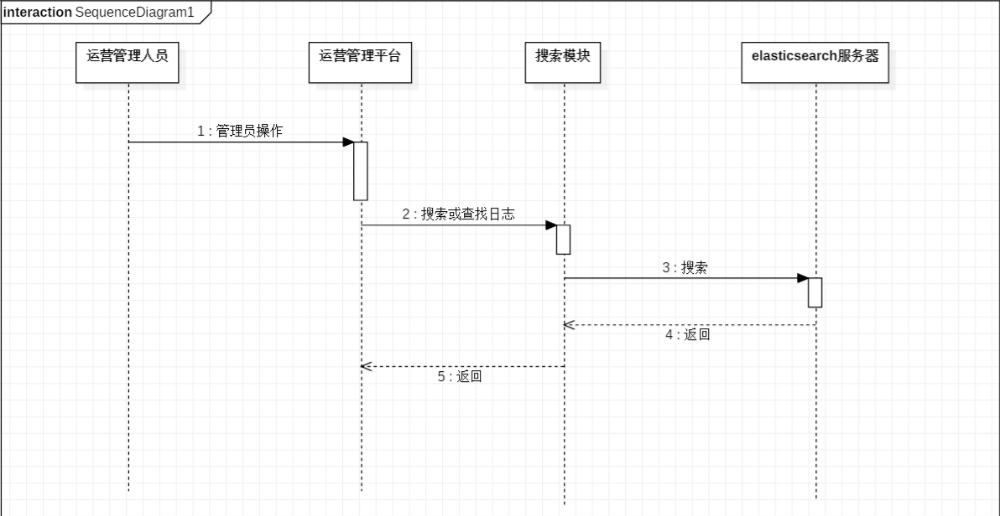

# UML

## 1.用例图

### 1.1 定义

​	用例图是指由参与者（Actor）、用例（Use Case）以及他们之间的关系构成的用于描述系统功能的静态视图。用例图是被称为参与者的外部用户所能观察到的系统功能的模型图，呈现了一些参与者和一些用例，以及他们之间的关系，主要用于对系统、子系统或类的功能行为进行建模。

​	用例图的组成：系统边界、参与者、用例、关系。

​	参与者：Actor不是人，而是指参与用例时担当的角色。

### 1.2 如何识别参与者

1. 是谁向系统提供的信息
2. 谁向系统获取信息
3. 谁操作系统

### 1.3 如何确定用例的粒度

​	用例的粒度（用例的大小）可大可小，一般一个系统易控制在20个左右。用例是系统级的抽象的描述，不是细化的（是做什么，非怎样做）。对复杂系统可以划分为若干个子系统处理。

### 1.4 如何获取用例

- 参与者希望系统执行什么任务？
- 参与者在系统中访问哪些信息（创建、存储、修改、删除等）？
- 需要将外界的哪些信息提供给系统？
- 需要将系统的哪个事件告诉参与者？

### 1.5 UML中的四种关系

- 关联（association）
- 包含（include）
- 扩展（extend）
- 泛化（generalization）

####     1.5.1 关联关系

​	描述参与者和用例之间的关系。用单向箭头，表示谁启动用例。每个用例都有角色启动，除了包含和扩展用例

#### 	1.5.2 包含关系

​	是指两个用例之间的关系，其中一个用例（基本用例，base use case）的行为包含了另一个用例（包含用例，inclusion use case）的行为。

​	如果两个以上用例有大量一致的功能，则可以将这个功能分解到另一个用例中，其他用例可以和这个用例建立包含关系。

​	上面的例子就是说查询、提款和转账三个用例都有一个一致的功能，所以将这个功能提取出来为一个用例。且者三个用例和提取出来的这个用例之间是包含的关系。

​	执行基本用例的时候也可以执行被包含的用例，被包含的用例也可以单独执行。

​	如果一个用例的功能太多时，可以用包含关系建模成两个或多个用例

#### 1.5.3 扩展关系

​	扩展也是指两个用例之间的关系。一个用例可以被定义为基础用例的增量的扩展，称作为扩展关系。扩展关系是把新的行为插入到已有的用例中方法。基础用例即使没有扩展用例的执行不会涉及扩展用例，只有在特定的条件发生，扩展用例才被执行。

#### 1.5.4 泛化（继承）关系

​	一个用例和其几种情形的用例间构成泛化关系。往往父用例表示为抽象用例。

​	任何父用例出现的地方子用例也可出现。

## 2.组件图

### 2.1 定义

​	组件图又称为构件图（Component Diagram）。组件图通常包括组件、接口，以及各种关系。组件图显示组件以及他们之间的依赖关系，他可以用来显示程序代码如何分解成模块或组件。

### 2.2 组件元素

​	组件图中主要包含三种元素，即组件、接口和关系。

​	**组件**：系统功能的可重用部件。组件通过接口提供并使用行为，并且可以使用其他组件。

​	**提供的接口**：表示某个组件实现的且其他组件或外部系统可以使用的一组消息或调用。

​	**所需的接口**：表示组件发送到其他组件或外部系统的一组消息或调用。

​	**依赖关系**：可用于指示一个组件上的所需的接口可以被另外一个组件上提供的接口满足

## 3.时序图

### 3.1 定义

​	时序图，通过业务处理的参与者的顺序协作来展示软件的不同组件如何协作来完成业务。

​	时序图（Sequence Diagram）是显示对象之间交互的图，这些对象是按时间顺序排列的。顺序图中显示的是参与交互的对象及其对象之间消息交互的顺序。

​	时序图中包括的建模元素主要有：对象（Actor）、生命线（Lifeline）、控制焦点（Focus of control）、消息（Message）等等。

### 3.2 建模元素

#### 3.2.1 角色（Actor）

​	系统角色，可以是人、及其甚至其他的系统或者子系统。

#### 3.2.2 对象（Object）

​	对象包括3种命名方式

- 包括对象名和类型
- 只显示类名不显示对象名，即表示他是一个匿名对象
- 只显示对象名不显示类名

#### 3.2.3 生命线（Lifeline）

​	生命线在顺序图中表示为从对象图标向下延伸的一条虚线，表示对象存在的时间

#### 3.2.4 控制焦点（Focus of control）

​	控制焦点是时序图中表示时间段的符号，在这个时间段内对象将执行相应的操作，用小矩形表示。

#### 3.2.5 消息（Message）

​	消息一般分为同步消息（Synchronous Message），异步消息（Asynchronous Message）和返回消息（Return Message）。

- **同步消息**：消息的发送者把控制传递给消息的接收者，然后停止活动，等待消息的接收者放弃或者返回控制。用来表示同步的意义。
- **异步消息**：消息发送者通过消息把信号传递给消息的接收者，然后继续自己的活动，不等待接收者返回消息或者控制，异步消息的接收者和发送者是并发工作的。
- **返回消息**：返回消息表示从过程调用返回。
- **自关联消息**：表示方法的自身调用以及一个对象内的一个方法调用另外一个方法。

## 4.活动图

### 4.1 定义

​		活动图是UML用于对系统的动态行为建模的另一种常用工具，他描述活动的顺序，展现从一个活动到另一个活动的控制流。活动图在本质是一种流程图。活动图着重表现从一个活动到另一个活动的控制流，是内部处理驱动的流程。

### 4.2 组成元素

#### 4.2.1 活动状态图（Activity） activiti：流程审批

​	活动状态用于表达状态机中的非原子的运行，其特点如下：

1. 活动状态可以分解成其他子活动或者动作状态。

2. 活动状态的内部活动可以用另一个活动图来表示。

3. 和动作状态不同，活动状态可以有入口动作和出口动作，也可以有内部转移。

4. 动作状态是活动状态的一个特例，如果某个活动状态只包括一个动作，那么他就是一个动作状态。

   UML中活动状态和动作状态的图标相同，但是活动状态可以在图标中给出入口动作和出口动作等消息。

#### 4.2.2 动作状态图（Actions）

​	动作状态是指原子的， 不可中断的动作，并在此动作完成后通过完成转换转向另一个状态。动作状态有如下特点：

1. 动作状态是原子的，他是构造活动图的最小单位。
2. 动作状态时不可中断的。
3. 动作状态是瞬时的行为。
4. 动作状态可以有入转换，入转换既可以是动作流，也可以是对象流。动作状态至少有一条出转换，这条转换以内部的完成为起点，与外部事件无关。
5. 动作状态与状态图中的状态不同，他不能有入口动作和出口动作，更不能有内部转移。
6. 在一张活动图中，动作状态允许多处出现。

#### 4.2.3 动作流（Control Flow）

​	动作之间的转换称之为动作流，活动图的转换用带箭头的直线表示，箭头的方向指向转入的方向。

#### 4.2.4 开始节点（Initial Node）

​	开始节点，表示成实心黑色圆点

#### 4.2.5 终止节点（Final Node）

​	分为活动终止节点（activity final nodes）和流程终止节点（flow final nodes），活动终止节点表示整个活动的结束。

#### 4.2.6 对象（Object）

#### 4.2.7 数据存储对象（DataStore）

#### 4.2.8 分支与合并（Decision and Merge Nodes）

​	分支与合并用菱形表示，他有一个进入转换（箭头从外指向分支符号），一个或多个离开转换（箭头从分支符号指向外）。而每个离开转换都会有一个监护条件，用来表示满足什么条件的时候执行该转换。

#### 4.2.9 分叉与汇合（Fork and Join Nodes）

​	分为水平风向和垂直风向。对象在运行时可能会存在两个或多个并发运行的控制流，为了对并发的控制流建模，UML中引入分叉与汇合的概念。分叉用于将动作流分为两个或多个并发运行的分支，而汇合则用于同步这些并发分支，以达到共同完成一项事务的目的。

#### 4.2.10 泳道

​	泳道将活动图中的活动分为若干组，并把每一组指定给负责这组活动的业务组织，即对象。在活动图中，泳道区分了负责活动的对象，他明确的表示了哪些活动是由哪些对象进行的。在包含泳道的活动图中，每个活动只能明确的属于一个泳道。

​	泳道是用垂直实线绘出，垂直线分割的区域就是泳道。在泳道的上方可以给出泳道的名字或者对象的名字，该对象负责泳道内的全部活动。泳道没有顺序，不同泳道中的活动既可以顺序进行也可以并发进行，动作流和对象流允许穿越分割线。

### 4.3 画活动图的原则

- 活动图的目的在于表达“流程完整性”而非活动细节
- 活动图中的元素（主要是活动）不必考虑复用性
- 如果活动图中绘制了“分叉点”，则一定要有一个“会合点”与之对应
- 活动图中尽量不要表达“文件”与“数据”

