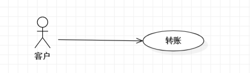
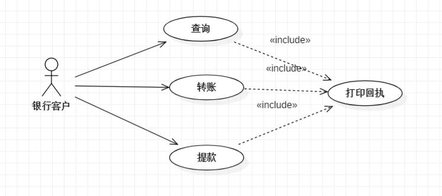
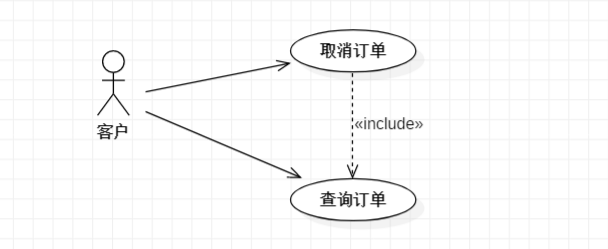
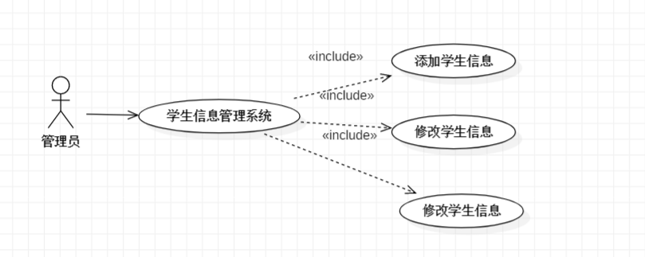
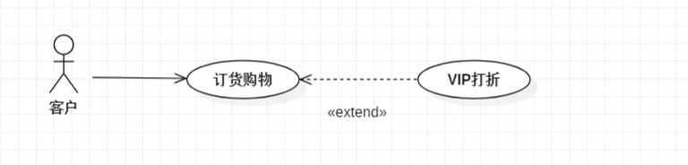
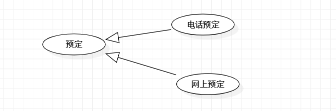
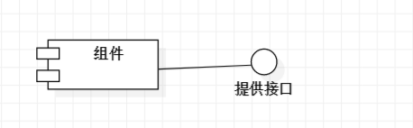
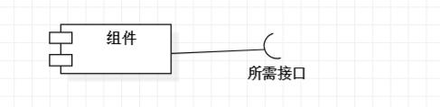
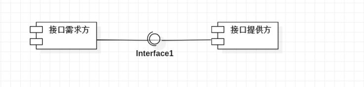

# UML

## 1.用例图

### 1.1 定义

​	用例图是指由参与者（Actor）、用例（Use Case）以及他们之间的关系构成的用于描述系统功能的静态视图。用例图是被称为参与者的外部用户所能观察到的系统功能的模型图，呈现了一些参与者和一些用例，以及他们之间的关系，主要用于对系统、子系统或类的功能行为进行建模。

​	用例图的组成：系统边界、参与者、用例、关系。

​	参与者：Actor不是人，而是指参与用例时担当的角色。

### 1.2 如何识别参与者

1. 是谁向系统提供的信息
2. 谁向系统获取信息
3. 谁操作系统

### 1.3 如何确定用例的粒度

​	用例的粒度（用例的大小）可大可小，一般一个系统易控制在20个左右。用例是系统级的抽象的描述，不是细化的（是做什么，非怎样做）。对复杂系统可以划分为若干个子系统处理。

### 1.4 如何获取用例

- 参与者希望系统执行什么任务？
- 参与者在系统中访问哪些信息（创建、存储、修改、删除等）？
- 需要将外界的哪些信息提供给系统？
- 需要将系统的哪个事件告诉参与者？

### 1.5 UML中的四种关系

- 关联（association）
- 包含（include）
- 扩展（extend）
- 泛化（generalization）

####     1.5.1 关联关系

​	描述参与者和用例之间的关系。用单向箭头，表示谁启动用例。每个用例都有角色启动，除了包含和扩展用例

#### 	1.5.2 包含关系

​	是指两个用例之间的关系，其中一个用例（基本用例，base use case）的行为包含了另一个用例（包含用例，inclusion use case）的行为。

​	如果两个以上用例有大量一致的功能，则可以将这个功能分解到另一个用例中，其他用例可以和这个用例建立包含关系。

​	上面的例子就是说查询、提款和转账三个用例都有一个一致的功能，所以将这个功能提取出来为一个用例。且者三个用例和提取出来的这个用例之间是包含的关系。

​	执行基本用例的时候也可以执行被包含的用例，被包含的用例也可以单独执行。

​	如果一个用例的功能太多时，可以用包含关系建模成两个或多个用例

#### 1.5.3 扩展关系

​	扩展也是指两个用例之间的关系。一个用例可以被定义为基础用例的增量的扩展，称作为扩展关系。扩展关系是把新的行为插入到已有的用例中方法。基础用例即使没有扩展用例的执行不会涉及扩展用例，只有在特定的条件发生，扩展用例才被执行。

#### 1.5.4 泛化（继承）关系

​	一个用例和其几种情形的用例间构成泛化关系。往往父用例表示为抽象用例。

​	任何父用例出现的地方子用例也可出现。

## 2.组件图

### 2.1 定义

​	组件图又称为构件图（Component Diagram）。组件图通常包括组件、接口，以及各种关系。组件图显示组件以及他们之间的依赖关系，他可以用来显示程序代码如何分解成模块或组件。

### 2.2 组件元素

​	组件图中主要包含三种元素，即组件、接口和关系。

​	**组件**：系统功能的可重用部件。组件通过接口提供并使用行为，并且可以使用其他组件。

​	**提供的接口**：表示某个组件实现的且其他组件或外部系统可以使用的一组消息或调用。

​	**所需的接口**：表示组件发送到其他组件或外部系统的一组消息或调用。

​	**依赖关系**：可用于指示一个组件上的所需的接口可以被另外一个组件上提供的接口满足

